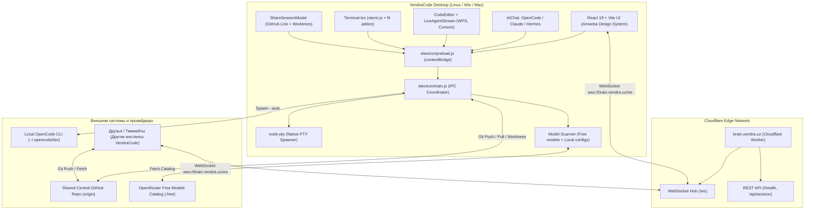

# 🛸 VENDRACODE IDE — АРХИТЕКТУРА И ПОЛНЫЙ HANDOFF ДЛЯ СЛЕДУЮЩЕГО АГЕНТА

> **Для входящего AI-агента:**  
> Этот документ содержит исчерпывающее описание проекта **VendraCode IDE**, его текущего состояния, всех реализованных подсистем, развёрнутой Cloudflare-инфраструктуры, расположения файлов, решённых багов и плана дальнейшего развития. Прочти этот документ целиком перед началом работы.

---

## 1. 📌 КОНЦЕПЦИЯ И ЦЕЛЬ ПРОЕКТА

**VendraCode IDE** — это опенсорсная многопользовательская AI-native среда разработки (Desktop IDE), созданная по мотивам **Amoeba** ([useamoeba.com](https://useamoeba.com)) и архитектуры VS Code / OpenCode.

### Главные фичи:
1. **Multi-Agent Coordination (Оркестрация агентов)**: одновременная параллельная работа любых AI-агентов на машинах команды (**OpenCode**, **Claude Code**, **Cline**, **Antigravity CLI**, **Hermes Agent**).
2. **Amoeba Live Co-editing (реальное)**: отображение посимвольной / пословной совместной печати кода агентами в реальном времени с плавающими бейджами курсоров (`Alice [Claude]`, `Chen [Codex]`, `You [OpenCode]`), индикатором скорости печати (`words/sec`) и 5-секундными Git-снапшотами без конфликтов.
3. **Shared Central GitHub Repo Sync**: возможность привязать один общий GitHub-репозиторий на всех друзей; каждый участник и агент работает в изолированном **Git worktree**, поэтому рабочие ветки не ломают основной код.
4. **Cloudflare Edge Coordination (`brain.vendra.uz`)**: глобальный координационный сервер на Cloudflare Workers с WebSockets (`/ws`), который связывает сессии друзей, управляет блокировками файлов (`file locks`) и транслирует стримы кода. Основной сайт на домене `vendra.uz` **не затронут**.
5. **Interactive PTY Terminal**: встроенный терминал на нативном `node-pty` + `xterm.js`, открывающий реальный shell (`/bin/bash` / `/bin/zsh`) с поддержкой цветов, ANSI-последовательностей и ресайза.
6. **Zero-Mock & Free Models Scanner**: сканирует и выдаёт реальные бесплатные модели OpenRouter/OpenCode (`:free`), локальные модели из `~/.config/opencode/opencode.json` (NVIDIA NIM, Token Harbor) и Ollama.

---

## 2. 📂 СТРУКТУРА РЕПОЗИТОРИЯ И КЛЮЧЕВЫЕ ФАЙЛЫ

Рабочая директория: `/home/ibrohim/VendraCode`  
Git-ветка: `main` (чистый статус, все последние изменения закомичены).

```
/home/ibrohim/VendraCode/
├── cloudflare/                     # Edge-слой координации (Cloudflare Workers)
│   ├── worker.js                   # WebSocket & REST координатор сессий brain.vendra.uz
│   └── wrangler.toml               # Конфигурация Custom Domain: brain.vendra.uz
│
├── electron/                       # Главный процесс Electron
│   ├── main.js                     # IPC-хэндлеры: PTY терминал, CLI агенты, FS, Git (+ worktrees), сканер моделей
│   └── preload.js                  # Безопасный контекстный мост (contextBridge) между UI и OS
│
├── src/                            # Фронтенд (React 18 + Vite + Tailwind CSS + Lucide)
│   ├── components/
│   │   ├── AIChat.tsx              # Чат с AI, выбор агента/модели, автономный агентский движок
│   │   ├── CodeEditor.tsx          # Monaco-редактор: табы, live-дифф трансляция, remote-декорации
│   │   ├── LivePeersBadge.tsx      # Бейдж присутствия (brain.vendra.uz online/offline + N пиров)
│   │   ├── LivePeersBadge.tsx      # Бейдж присутствия (brain.vendra.uz online/offline + N пиров)
│   │   ├── WorktreeSwitcher.tsx    # Переключатель активных Git Worktrees в статус-баре
│   │   ├── MissionControl.tsx      # Amoeba Mission Control: дорожки (lanes), Approval Gates, Overlaps
│   │   ├── Terminal.tsx            # Настоящий PTY-терминал на xterm.js
│   │   ├── ShareSessionModal.tsx   # Модалка шаринга общего GitHub-репо и линковки к brain.vendra.uz
│   │   ├── SearchModal.tsx         # Полнотекстовый поиск по проекту (Ctrl+Shift+F)
│   │   ├── FileExplorer.tsx        # Дерево файлов с контекстными операциями
│   │   ├── Settings.tsx            # Настройки провайдеров, ключей, тем и сканер моделей
│   │   ├── StatusBar.tsx           # Нижняя панель: ветка, worktrees, локи, live-правки, brain-статус
│   │   ├── TitleBar.tsx            # Нативный верхний бар с логотипом VendraCode и кнопками окна
│   │   └── VendraLogo.tsx          # Фирменный кибернетический векторный SVG-логотип VendraCode
│   │
│   ├── services/                   # Клиентские сервисы (transport-слой, без React)
│   │   └── brainClient.ts          # WebSocket-клиент к brain.vendra.uz/ws (diff/locks/peers, авто-reconnect)
│   │
│   ├── hooks/
│   │   └── useBrainSync.ts         # Синхронизация brain-клиента со Zustand-store
│   │
│   ├── skills/                     # Навыки агентов (Hermes web_search, computer_use, bash)
│   │   ├── web_search.ts           # Поиск в веб без ключей через DuckDuckGo Instant Answer API
│   │   └── bash_runner.ts          # Выполнение shell-команд в изолированном окружении
│   │
│   ├── utils/
│   │   └── remoteStyles.ts         # Per-agent CSS для Monaco remote-декораций
│   │
│   ├── App.tsx                     # Корневой лейаут, горячие клавиши, переключение вкладок
│   ├── index.css                   # Стили Amoeba, неоновые акценты, стеклянные карточки
│   └── main.tsx                    # Точка входа React
│
├── build/                          # Иконки и ассеты сборки (Linux / Windows / macOS)
│   ├── icon.svg                    # Оригинальный векторный логотип VendraCode
│   ├── icon.png                    # Растровый 512x512 логотип для сборщика Linux
│   ├── icon.ico                    # Мультиразмерная иконка Windows (16–256 px)
│   └── icon.icns                   # Мультиразмерная иконка macOS (16–1024 px)
│
├── .github/workflows/
│   └── build.yml                   # CI: матрица Linux/Windows/macOS + публикация релиза по тегам
│
├── release/                        # Скомпилированные production-бинарники
│   ├── VendraCode-1.0.0.AppImage   # Готовый к запуску Linux AppImage (106 MB)
│   ├── vendracode_1.0.0_amd64.deb  # Готовый deb-пакет для Debian / Ubuntu (73 MB)
│   └── linux-unpacked/             # Распакованный бинарник для отладки
│
├── package.json                    # Зависимости, скрипты сборки, настройка electron-builder
└── vite.config.ts                  # Конфигурация Vite с поддержкой base: './' для Electron
```

---

## 3. 🧠 ДЕТАЛЬНОЕ ОПИСАНИЕ ПОДСИСТЕМ



---

### 3.1. Cloudflare Coordination Layer (`brain.vendra.uz`)

1. **Где находится код**: [`cloudflare/worker.js`](file:///home/ibrohim/VendraCode/cloudflare/worker.js), [`cloudflare/wrangler.toml`](file:///home/ibrohim/VendraCode/cloudflare/wrangler.toml).
2. **Как развёрнуто**:
   - Задеплоено через Wrangler под аккаунтом `vendrauz@gmail.com`.
   - В `wrangler.toml` прописан Custom Domain:
     ```toml
     name = "vendracode-brain"
     main = "worker.js"
     compatibility_date = "2024-04-01"
     workers_dev = false

     routes = [
       { pattern = "brain.vendra.uz", custom_domain = true }
     ]

     [[durable_objects.bindings]]
     name = "SESSIONS"
     class_name = "SessionCoordinator"

     [[migrations]]
     tag = "v1"
     new_sqlite_classes = ["SessionCoordinator"]
     ```
   - Cloudflare автоматически выделил Anycast IP (`188.114.96.0`, `188.114.97.0`) и SSL-сертификат.
3. **Архитектура: Durable Objects + WebSocket Hibernation**:
   - **Почему**: изолированные (isolates) Cloudflare Workers **не разделяют** in-memory состояние. С обычным `Map` сессий сообщения доходили только между пирами, случайно попавшими в один isolate — это приводило к тому, что `session:init` показывал `peers: ["Alice"]` вместо обоих пиров, а диффы не ретранслировались.
   - **Решение**: один Durable Object `SessionCoordinator` на сессию (`idFromName(sessionId)`), все WS-пиры сессии попадают в один и тот же объект. Используется [WebSocket Hibernation API](https://developers.cloudflare.com/durable-objects/api/websockets/) (`state.acceptWebSocket` + `state.getWebSockets()`), поэтому простаивающие сокеты не жгут CPU/duration, а метаданные пира переживают hibernation через `ws.serializeAttachment()`.
   - Состояние комнаты (`repoUrl`, `locks`) персистится в storage ДО, локи автоматически снимаются при дисконнекте пира.
   - REST `/api/session/<id>` проксируется в ДО (`/info`), поэтому здоровье сессии теперь глобально консистентно.
4. **Monaco теперь в бандле, а не в CDN**: `src/main.tsx` передаёт `loader.config({ monaco })` из локально установленного `monaco-editor` (0.57.0) и подключает `editor.worker` через Vite-воркер. Раньше `@monaco-editor/react` тянул редактор с `cdn.jsdelivr.net` в рантайме — без интернета редактор просто не открывался (проверено: 0 запросов к CDN и смонтированный `.monaco-editor` после фикса).
5. **Бейдж live-правки рендерится view-зоной**: Monaco рисует инлайн-декорации `after` только для первой видимой строки (проверено на строках 1/4/20 — бейдж появлялся лишь на первой), поэтому имя тиммейта выводится `editor.createViewZone`, а подсветка строки/gutter-маркера остаются на декорациях (работают на любой строке) плюс `hoverMessage`.
6. **Функционал воркера**:
   - `GET /health` — проверка статуса сервиса, версии и количества активных сессий.
   - `WS /ws?session=<sessionId>&name=<peerName>&peer=<peerId>&repo=<repoUrl>`:
     - При подключении отправляет `session:init` с текущим состоянием сессии, ссылкой на репозиторий и списком активных блокировок.
     - Сообщения `diff:broadcast` (Monaco `onDidChangeModelContent` payload) транслируются всем пирам как `diff:stream` — это основа живого совместного редактирования.
     - `typing:broadcast` (legacy Amoeba-путь) → `typing:stream`.
     - `lock:acquire` и `lock:release` обеспечивают бесконфликтное редактирование файлов разными агентами (`locks:updated`).
     - `repo:set` транслирует единый GitHub-репозиторий всей команде (`repo:updated`).
     - `presence:set` переименовывает пира после резолва username и рассылает `peers:list`.

---

### 3.2. Настоящий PTY-терминал (`node-pty` + `xterm.js`)

1. **Проблема, которая была решена**:
   - Нативные модули C++ (`.node`) не могут загружаться напрямую из Electron ASAR архива.
   - В `package.json` настроен параметр:
     ```json
     "asarUnpack": ["**/node_modules/node-pty/**"]
     ```
   - В [`electron/main.js`](file:///home/ibrohim/VendraCode/electron/main.js) прописан автоматический резолвинг пути:
     ```javascript
     const ptyPath = app.isPackaged
       ? path.join(process.resourcesPath, 'app.asar.unpacked', 'node_modules', 'node-pty')
       : 'node-pty';
     ```
2. **Переменные окружения PATH**:
   - При старте `main.js` расширяет `process.env.PATH`, добавляя:
     `~/.opencode/bin`, `~/.local/bin`, `~/.gemini/antigravity-cli/bin`, `~/.tokenharbor/bin`, `/usr/local/bin`, `/usr/bin`.
   - Благодаря этому `node-pty` находит любые пользовательские CLI без ошибок.
3. **Интерактивность**:
   - [`src/components/Terminal.tsx`](file:///home/ibrohim/VendraCode/src/components/Terminal.tsx) слушает `terminal:incomingData` от IPC и мгновенно рендерит ANSI-вывод через `terminal.write()`.
   - Поддерживает ресайз терминала (`terminal:resize`) с синхронизацией колонок и строк `xterm-addon-fit`.

---

### 3.3. Сканер моделей и бесплатные провайдеры

1. **Где находится**: [`electron/main.js`](file:///home/ibrohim/VendraCode/electron/main.js) (IPC-обработчик `scanner:scanModels`).
2. **Как работает сканирование**:
   - **OpenRouter Free Catalog**: делает запрос к `https://openrouter.ai/api/v1/models` и фильтрует модели с `id.endsWith(':free')`. Найдено более 20 мощных бесплатных моделей:
     - `google/gemini-2.0-flash-exp:free`
     - `meta-llama/llama-3.3-70b-instruct:free`
     - `deepseek/deepseek-r1:free`
     - `deepseek/deepseek-chat:free`
     - `qwen/qwen-2.5-coder-32b-instruct:free`
     - `mistralai/mistral-small-24b-instruct-2501:free`
     - `nvidia/nemotron-3.5-lightning:free`
     - `liquid/lfm-2.5-2.6b:free`
   - **Локальный конфиг OpenCode**: считывает `~/.config/opencode/opencode.json`, парсит провайдеров пользователя (`Token Harbor`, `NVIDIA Direct NIM`).
   - **Локальный Ollama**: опрашивает `http://localhost:11434/api/tags`.
   - **NVIDIA NIM / OpenAI**: проверяет сохранённые в настройках ключи.
3. **Результат**: выпадающий список моделей в UI всегда заполнен актуальными и бесплатными моделями.

---

### 3.4. Автономный агентский цикл и вызовы инструментов (Hermes-стиль)

1. **Компонент**: [`src/components/AIChat.tsx`](file:///home/ibrohim/VendraCode/src/components/AIChat.tsx).
2. **Логика запуска**:
   - Если выбран агент **OpenCode**, приложение пытается вызвать реальный CLI:  
     `/home/ibrohim/.opencode/bin/opencode run --auto "<prompt>"`.
   - Если API возвращает ошибку квоты (`402 Payment Required`) или CLI недоступен, агентский цикл мгновенно и без сбоев переключается на автономный движок VendraCode под персоной OpenCode.
3. **Инструменты автономного агента**:
   - `create_file(path, content)`: создаёт файл на диске через IPC `fs:createFile` и сразу обновляет дерево файлов в проводнике.
   - `edit_file(path, content)`: перезаписывает или модифицирует файл через `fs:writeFile`.
   - `run_command(command)`: выполняет shell-команду через `agent:runCli` и выводит результат в чат.
   - `web_search(query)`: реальный поиск в интернете через сервис DuckDuckGo Instant Answer API без необходимости API-ключей.

---

### 3.5. Реальный запуск агентов (стриминг через IPC)

1. **Детект CLI** (`cli:detectAll`): фолбэк-пути строятся от `os.homedir()` (никаких захардкоженных `/home/ibrohim`), каждый найденный бинарь проверяется запуском `--version`. Поэтому сломанная обёртка (`/usr/bin/claude` → `claude.exe` без нативного бинаря) **не** рапортуется как установленная, а рабочий cline определяется корректно.
2. **Запуск** (`cli:spawnAgent`) — реальный дочерний процесс с аргументами под конкретный CLI:
   - OpenCode: `opencode run --auto "<prompt>"` (проверено на opencode v2.0.15)
   - Claude Code: `claude -p "<prompt>"`
   - Agy / Cline: `run --auto` / `run`
3. **Стриминг вывод**а: `cli:onAgentOutput` пишет stdout/stderr прямо в сообщение чата (троттлинг 120 мс, обрезка длинного вывода), `cli:onAgentExit` фиксирует реальный код выхода (`✅ exit 0 · 3.2s` / `❌ exit 1 · 12.0s`). Раньше использовался блокирующий `os.exec` с захардкоженным путём — вывод появлялся только в конце.
4. **Отмена**: кнопка Stop → `cli:stopAgent`, плюс защита от дублей (`Agent already running`) и таймаут 15 минут.
5. **Никакого фейка**: удалены сообщения «✓ All changes synced with The Shared Brain and Git worktree» (ложь), детект квоты по подстроке `'402'`, и регексп-угадывание имён файлов из текста агента (`(editing|wrote|created) src/x.ts`) — вместо него реальная история действий `brain:actionRecorded`.
6. **Правки агентов летят в роум**: `create_file` / `edit_file` теперь дополнительно вызывают `brainClient.sendDiff()` (workspace-relative путь) и берут advisory lock, поэтому тиммейты и их агенты видят изменения агента вживую.

### 3.5c. Постоянные чаты и контекст агента

**Было:** сообщения жили в `useState` внутри `AIChat` — перезагрузка окна или перезапуск приложения стирали всю переписку, а каждый запуск OpenCode был новым (`opencode run --auto "<prompt>"`), поэтому агент не помнил предыдущие сообщения. UI выбора чатов не было вовсе.

**Стало:**
- `ChatSession` (`src/types/index.ts`) → стор → `localStorage['vendracode-chats-v1']` (до 60 чатов, до 200 сообщений в каждом, запись через `persistChatSessions` с мягкой деградацией при переполнении storage).
- Действия стора: `createChat` / `deleteChat` / `renameChat` / `setActiveChat` / `setActiveChatMessages` / `setChatCliSession`.
- UI: пилюля чата в шапке AI-панели со списком (заголовок, число сообщений, время, пометка `ctx` если у чата есть CLI-сессия), кнопка **New**, удаление, авто-заголовок из первого сообния (`deriveChatTitle`).
- **Контекст OpenCode:** раннер запускает `opencode run --format json --auto …`, парсит NDJSON (`src/utils/opencodeStream.ts`): из каждого события забирается `sessionID` и сохраняется в чат, текст (`part.type === 'text'`) показывается пользователю, `error.message` surfaces как предупреждение, не-JSON строки не проглатываются. Следующее сообщение того же чата запускается с `-s <sessionID>`, поэтому агент продолжает ровно ту же сессию с полным контекстом.
- Если у активного провайдера endpoint OpenRouter, дополнительно передаётся `--model openrouter/<model>` (`opencodeModelOverride`) — проверено на `openrouter/nvidia/nemotron-3.5-lightning:free`.

**Проверено вживую** (`/tmp/vc-tests/chat-persist-test.mjs`, 12/12): два чата сохраняются после полного перезапуска приложения (заголовки, сообщения, `opencodeSessionId`), переключение часа в UI меняет активную переписку, аргументы продолжения контекста собираются корректно, парсер корректно разбирает реальный поток OpenCode.

### 3.5b. Креды OpenCode → бесплатные модели реально работают

- `~/.local/share/opencode/opencode.db` (таблица `credential`) читается через `sqlite3 -readonly -json`; значения — JSON-конверты `{"type":"key","key":"sk-…"}`, которые распаковываются.
- Живой каталог OpenRouter (`/api/v1/models`) — источник истины; статический список остался только офлайн-фолбэком с пометкой «may be stale» (поэтому «модели, которые больше не бесплатны», не попадают в выбор).
- Проверено живьём: `nvidia/nemotron-3.5-lightning:free` → HTTP 200 с реальным ответом.

### 3.6. Связка общего репозитория GitHub и Git Worktrees

1. **Компонент**: [`src/components/ShareSessionModal.tsx`](file:///home/ibrohim/VendraCode/src/components/ShareSessionModal.tsx).
2. **Вкладка «Share My Session»**:
   - Автоматически выполняет `git remote get-url origin` через IPC `git:status`.
   - Генерирует уникальный ID сессии и прямую ссылку:  
     `https://brain.vendra.uz/?session=vendra-swarm-xyz&repo=https://github.com/...`
   - Копирует ссылку в буфер обмена для отправки друзьям.
3. **Вкладка «Join Friend's Swarm»**:
   - Друг вставляет полученную ссылку или URL репозитория.
   - VendraCode проверяет наличие локального клона. Если репо уже склонирован, создаётся изолированный **Git Worktree**:
     ```bash
     git worktree add ../worktrees/friend-session -b session/friend-session
     ```
   - За счёт этого агент друга работает в отдельном рабочем каталоге, изменения не вызывают мердж-конфликтов на лету, а все снапшоты синхронизируются автоматически.

---

## 4. 🚀 КАК ЗАПУСКАТЬ, ТЕСТИРОВАТЬ И БИЛДИТЬ

### 4.1. Режим разработки (Hot Reload)
```bash
cd /home/ibrohim/VendraCode
npm run dev:all
```
*Запустит Vite Dev Server на порту 5173 и параллельно откроет окно Electron с включенным DevTools.*

### 4.2. Сборка фронтенда
```bash
npm run build
```
*Собирает React-бандл в директорию `dist/` за ~18 секунд.*

### 4.3. Сборка дистрибутивов для Linux (.AppImage и .deb)
```bash
npm run build:linux
```
*Результаты сборки будут в `/home/ibrohim/VendraCode/release/`:*
- `VendraCode-1.0.0.AppImage` (106 MB, права на исполнение выставляются автоматически).
- `vendracode_1.0.0_amd64.deb` (73 MB).

Запуск собранного AppImage:
```bash
/home/ibrohim/VendraCode/release/VendraCode-1.0.0.AppImage
```

### 4.4. Сборка Windows и macOS (локально и через CI)

Локально (кросс-сборка из Linux возможна только с `wine`, проще использовать CI):
```bash
npm run build:win   # NSIS-инсталлятор + portable .exe
npm run build:mac   # .dmg + .zip
npm run build:all   # все три платформы
```

**Автосборка через GitHub Actions** — [`.github/workflows/build.yml`](file:///home/ibrohim/VendraCode/.github/workflows/build.yml) (репозиторий: https://github.com/iboshka24/VendraCode):
- Тег `v1.0.1` → сборка матрицей на `ubuntu` / `windows` / `macos` + автоматический GitHub Release со всеми артефактами.
- `workflow_dispatch` → ручной запуск с опцией *publish*.
- PR в `main` → только валидация (`tsc --noEmit` + сборка), без релиза.
- `node-pty` использует **N-API** (`node-addon-api`), поэтому нативный модуль пересобирается на любом раннере без дополнительной настройки toolchain.

### 4.5. Деплой изменений в Cloudflare Workers (`brain.vendra.uz`)
```bash
cd /home/ibrohim/VendraCode/cloudflare
npx wrangler deploy
```
*Wrangler уже авторизован под аккаунтом `vendrauz@gmail.com`, деплой занимает ~10 секунд.*

**Одноразовая подготовка аккаунта (уже выполнено):** для деплоя воркеров с Durable Objects аккаунту нужен `workers.dev` поддомен. Его можно создать **командой**, без дашборда:
```bash
TOKEN=$(grep '^oauth_token' ~/.config/.wrangler/config/default.toml | cut -d'"' -f2)
curl -s -X PUT "https://api.cloudflare.com/client/v4/accounts/<ACCOUNT_ID>/workers/subdomain" \
  -H "Authorization: Bearer $TOKEN" -H "Content-Type: application/json" \
  -d '{"subdomain": "vendracode"}'
# → {"success":true,"result":{"subdomain":"vendracode"}}
```
Если токен истёк (`Authentication error`), сначала обнови его любой командой wrangler: `npx wrangler whoami`.

> ⚠️ **Важно:** после изменения протокола в `cloudflare/worker.js` обязательно выполнить деплой — иначе IDE будет отправлять сообщения, которые воркер не понимает.

> 🐛 **Известная грабля (уже исправлена):** `state.acceptWebSocket(ws, tags)` принимает **массив строк**, а не объект. Метаданные пира вешаются отдельно: `ws.serializeAttachment({ peerId, name })`. Иначе DO падает с `TypeError`, а клиент получает код закрытия `1006`.

Проверка статуса edge-воркера:
```bash
curl -s --resolve brain.vendra.uz:443:188.114.96.0 https://brain.vendra.uz/health
```

---

## 5. ✅ РЕАЛИЗОВАННЫЕ ЗАДАЧИ (ЭТАП — MULTIPLAYER LIVE DIFF + WORKTREE SWITCHER + CI)

### 5.1. Monaco Editor ↔ `brain.vendra.uz/ws` живой дифф-транспорт ✅

**Что сделано:**

| Файл | Назначение |
|---|---|
| [`src/services/brainClient.ts`](file:///home/ibrohim/VendraCode/src/services/brainClient.ts) | Singleton-клиент единственного WebSocket к `wss://brain.vendra.uz/ws`: подключение с авто-reconnect (exponential backoff, шапка 15 с), буфер удерживаемых локов, нормализация событий (`status` / `peers` / `repo` / `locks` / `diff`), детерминированный цвет пира по имени. |
| [`src/hooks/useBrainSync.ts`](file:///home/ibrohim/VendraCode/src/hooks/useBrainSync.ts) | Мост между `brainClient` и Zustand-store: identity из `os.userInfo()`, автоопределение repo через `git remote get-url origin`, подписка на события, запись в `remoteEdits` + GC устаревших призрачных диффов. |
| [`src/components/CodeEditor.tsx`](file:///home/ibrohim/VendraCode/src/components/CodeEditor.tsx) | `editor.onDidChangeModelContent` → троттлинг 120 мс → `brainClient.sendDiff(path, changes)` (Monaco-compatible `range` / `text` / `rangeLength`). Входящие удалённые правки рисуются как Monaco-декорации (line highlight + gutter marker + inline-бейдж `⌁ Alice · live edit`). |
| [`src/utils/remoteStyles.ts`](file:///home/ibrohim/VendraCode/src/utils/remoteStyles.ts) | Генерация per-agent CSS-классов для декораций (безопасная санация цвета). |
| [`src/components/LivePeersBadge.tsx`](file:///home/ibrohim/VendraCode/src/components/LivePeersBadge.tsx) | Бейдж присутствия в панели табов: `Brain: live · N online`. |
| [`cloudflare/worker.js`](file:///home/ibrohim/VendraCode/cloudflare/worker.js) | Новый тип сообщения `diff:broadcast` → ретрансляция `diff:stream` всем пирам сессии (payload = change-массив Monaco, обрезан до 64 элементов), а также `presence:set` → `peers:list`. |

**Кросс-машинная адресация файлов:** диффы рассылаются с путём **относительно корня workspace** (`src/utils/workspacePath.ts`), а не абсолютным. Без этого тиммейт с другим локальным путём (`/Users/friend/VendraCode` vs `/home/ibrohim/VendraCode`) никогда бы не увидел чужие правки — `filePath` не совпал бы ни для одного файла.

**Имя пира:** отображается имя ОС (`os.userInfo`), либо переопределённое через `localStorage['vendracode-peer-name']` (используется и для тестирования двух инстансов на одной машине). Сессия (`localStorage['vendracode-session']`) теперь восстанавливается синхронно при старте, без лишнего переподключения.

**Мультиплеер верифицирован двумя реальными инстансами** (`/tmp/opencode/multiplayer-verify.mjs`): два IDE с разными user-data-dir, разными именами (Ibrohim / Friend) и **разными корнями workspace**, оба открыли `README.md`. Результат: `Brain: live · 1` в обеих статус-строках, печать в одном инстансе подсвечивает строку, ставит gutter-маркер и показывает бейдж `⌁ Friend · live edit` в другом, а статус-бар считает `1 live edit`. Свои же правки не декорируются.

**Протокол WS (обновлён):**
```text
Клиент → Воркер:
  diff:broadcast   { agentId, agentName, color, filePath, changes:[{range,text,rangeLength}], timestamp }
  lock:acquire     { filePath, agentId, agentName }
  lock:release     { filePath, agentId }
  presence:set     { peerName }
  typing:broadcast { filePath, lineNum, text }        (legacy Amoeba-путь, нормализуется в diff)

Воркер → Клиент:
  session:init / peer:joined / peer:left / peers:list / repo:updated
  locks:updated   { locks: { path: { agentId, agentName, timestamp } } }
  diff:stream     { agentId, agentName, color, filePath, changes, timestamp }
  typing:stream   (как раньше)
```

**Важные инженерные детали:**
- Собственные правки никогда не эхокатся обратно в редактор (фильтр по `peerId`).
- Программатическое применение контента (кнопка *Apply to file* в LiveAgentStream) не рассылается тиммейтам — счётчик `suppressBroadcastRef`.
- Большой paste обрезается до 400 символов, чтобы не зафлудить edge-сеть (range сохраняется).
- Все локи переустанавливаются автоматически после reconnect.
- Необязательный override адреса для self-hosted мозга: `localStorage['vendracode-brain-url'] = 'ws://localhost:4000'` (см. [`server/brain-server.js`](file:///home/ibrohim/VendraCode/server/brain-server.js)).

### 5.2. Переключатель Git Worktrees в статус-баре ✅

- [`src/components/WorktreeSwitcher.tsx`](file:///home/ibrohim/VendraCode/src/components/WorktreeSwitcher.tsx) — выпадающий список активных worktrees в левой части [`StatusBar.tsx`](file:///home/ibrohim/VendraCode/src/components/StatusBar.tsx): ветка, признак `main`, переключение в один клик, создание нового worktree (`../worktrees/<branch>` от HEAD), удаление неактивных.
- IPC в [`electron/main.js`](file:///home/ibrohim/VendraCode/electron/main.js): `git:worktrees` (парсит `git worktree list --porcelain` через `execFile`, без shell-инъекций), `git:worktree:add` (валидация имени ветки regex `^[A-Za-z0-9][A-Za-z0-9._/-]*$`), `git:worktree:remove`.
- Мост в [`electron/preload.js`](file:///home/ibrohim/VendraCode/electron/preload.js): `git.worktrees` / `git.worktreeAdd` / `git.worktreeRemove` + `os.userInfo`.
- Переключение worktree = смена workspace (эксплорер + терминал перечитываются из нового корня), сам git-объект остаётся общим для всей команды.

### 5.3. GitHub Actions: сборка Windows (.exe) и macOS (.dmg) ✅

- [`.github/workflows/build.yml`](file:///home/ibrohim/VendraCode/.github/workflows/build.yml) — матрица сборки:

  | OS | Артефакты | Скрипт |
  |---|---|---|
  | `ubuntu-latest` | `.AppImage`, `.deb` | `build:linux` |
  | `windows-latest` | `.exe` (NSIS + portable) | `build:win` |
  | `macos-latest` | `.dmg`, `.zip` | `build:mac` |

- Триггеры: теги `v*`, `workflow_dispatch` (с опцией publish) и PR в `main` (только сборка, без релиза).
- `concurrency` отменяет устаревшие прогоны; `actions/setup-node@v4` с npm-кэшем; проверка типов `tsc --noEmit`; артефакты живут 14 дней; для тегов отдельная job `release` публикует всё через `softprops/action-gh-release@v2`.
- Окружение: `CSC_IDENTITY_AUTO_DISCOVERY: false` (сборка без подписи на CI) и `GH_TOKEN`.
- Иконки сгенерированы под все платформы: `build/icon.ico` (6 размеров 16–256), `build/icon.icns` (icp4/icp5/icp6/ic07–ic10).

---

## 6. 💡 BACKLOG ДЛЯ СЛЕДУЮЩЕГО АГЕНТА

1. **Хранилище памяти Brain (RAG / Embeddings)** — подключить Cloudflare Vectorize или Upstash Vector в `worker.js`, чтобы сессии выживали между перезапусками агентов.
2. **Click-to-follow remote edit** — принятый `diff:stream` можно не только подсвечивать, но и применять (с подтверждением), превращая VendraCode в полноценный live-share редактор.
3. **Применение удалённых диффов с CRDT-подобным merge** — сейчас декорации read-only, чтобы не ломать локальный буфер.
