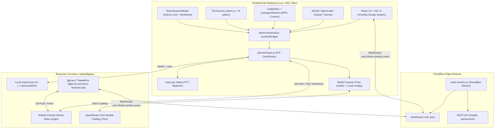

# 🛸 VENDRACODE IDE — АРХИТЕКТУРА И ПОЛНЫЙ HANDOFF ДЛЯ СЛЕДУЮЩЕГО АГЕНТА

> **Для входящего AI-агента:**  
> Этот документ содержит исчерпывающее описание проекта **VendraCode IDE**, его текущего состояния, всех реализованных подсистем, развёрнутой Cloudflare-инфраструктуры, расположения файлов, решённых багов и плана дальнейшего развития. Прочти этот документ целиком перед началом работы.

---

## 1. 📌 КОНЦЕПЦИЯ И ЦЕЛЬ ПРОЕКТА

**VendraCode IDE** — это опенсорсная многопользовательская AI-native среда разработки (Desktop IDE), созданная по мотивам **Amoeba** ([useamoeba.com](https://useamoeba.com)) и архитектуры VS Code / OpenCode.

### Главные фичи:
1. **Multi-Agent Coordination (Оркестрация агентов)**: одновременная параллельная работа любых AI-агентов на машинах команды (**OpenCode**, **Claude Code**, **Cline**, **Antigravity CLI**, **Hermes Agent**).
2. **Amoeba Live Co-typing**: отображение посимвольной / пословной совместной печати кода агентами в реальном времени с плавающими бейджами курсоров (`Alice [Claude]`, `Chen [Codex]`, `You [OpenCode]`), индикатором скорости печати (`words/sec`) и 5-секундными Git-снапшотами без конфликтов.
3. **Shared Central GitHub Repo Sync**: возможность привязать один общий GitHub-репозиторий на всех друзей; каждый участник и агент работает в изолированном **Git worktree**, поэтому рабочие ветки не ломают основной код.
4. **Cloudflare Edge Coordination (`brain.vendra.uz`)**: глобальный координационный сервер на Cloudflare Workers с WebSockets (`/ws`), который связывает сессии друзей, управляет блокировками файлов (`file locks`) и транслирует стримы кода. Основной сайт на домене `vendra.uz` **не затронут**.
5. **Interactive PTY Terminal**: встроенный терминал на нативном `node-pty` + `xterm.js`, открывающий реальный shell (`/bin/bash` / `/bin/zsh`) с поддержкой цветов, ANSI-последовательностей и ресайза.
6. **Zero-Mock & Free Models Scanner**: сканирует и выдаёт реальные бесплатные модели OpenRouter/OpenCode (`:free`), локальные модели из `~/.config/opencode/opencode.json` (NVIDIA NIM, Token Harbor) и Ollama.

---

## 2. 📂 СТРУКТУРА РЕПОЗИТОРИЯ И КЛЮЧЕВЫЕ ФАЙЛЫ

Рабочая директория: `/home/ibrohim/VendraCode`  
Git-ветка: `main` (чистый статус, все последние изменения закомичены).

```
/home/ibrohim/VendraCode/
├── cloudflare/                     # Edge-слой координации (Cloudflare Workers)
│   ├── worker.js                   # WebSocket & REST координатор сессий brain.vendra.uz
│   └── wrangler.toml               # Конфигурация Custom Domain: brain.vendra.uz
│
├── electron/                       # Главный процесс Electron
│   ├── main.js                     # IPC-хэндлеры: PTY терминал, CLI агенты, FS, Git, сканер моделей
│   └── preload.js                  # Безопасный контекстный мост (contextBridge) между UI и OS
│
├── src/                            # Фронтенд (React 18 + Vite + Tailwind CSS + Lucide)
│   ├── components/
│   │   ├── AIChat.tsx              # Чат с AI, выбор агента/модели, автономный агентский движок
│   │   ├── CodeEditor.tsx          # Редактор кода (Monaco-подобный) с табами и запуском Live Stream
│   │   ├── LiveAgentStream.tsx     # Amoeba-стиль: живая печать кода агентами с бейджами и WPS
│   │   ├── MissionControl.tsx      # Amoeba Mission Control: дорожки (lanes), Approval Gates, Overlaps
│   │   ├── Terminal.tsx            # Настоящий PTY-терминал на xterm.js
│   │   ├── ShareSessionModal.tsx   # Модалка шаринга общего GitHub-репо и линковки к brain.vendra.uz
│   │   ├── SearchModal.tsx         # Полнотекстовый поиск по проекту (Ctrl+Shift+F)
│   │   ├── FileExplorer.tsx        # Дерево файлов с контекстными операциями
│   │   ├── Settings.tsx            # Настройки провайдеров, ключей, тем и сканер моделей
│   │   ├── TitleBar.tsx            # Нативный верхний бар с логотипом VendraCode и кнопками окна
│   │   └── VendraLogo.tsx          # Фирменный кибернетический векторный SVG-логотип VendraCode
│   │
│   ├── skills/                     # Навыки агентов (Hermes web_search, computer_use, bash)
│   │   ├── web_search.ts           # Поиск в веб без ключей через DuckDuckGo Instant Answer API
│   │   └── bash_runner.ts          # Выполнение shell-команд в изолированном окружении
│   │
│   ├── App.tsx                     # Корневой лейаут, горячие клавиши, переключение вкладок
│   ├── index.css                   # Стили Amoeba, неоновые акценты, стеклянные карточки
│   └── main.tsx                    # Точка входа React
│
├── build/                          # Иконки и ассеты сборки
│   ├── icon.svg                    # Оригинальный векторный логотип VendraCode
│   └── icon.png                    # Растровый 512x512 логотип для сборщика Linux
│
├── release/                        # Скомпилированные production-бинарники
│   ├── VendraCode-1.0.0.AppImage   # Готовый к запуску Linux AppImage (106 MB)
│   ├── vendracode_1.0.0_amd64.deb  # Готовый deb-пакет для Debian / Ubuntu (73 MB)
│   └── linux-unpacked/             # Распакованный бинарник для отладки
│
├── package.json                    # Зависимости, скрипты сборки, настройка electron-builder
└── vite.config.ts                  # Конфигурация Vite с поддержкой base: './' для Electron
```

---

## 3. 🧠 ДЕТАЛЬНОЕ ОПИСАНИЕ ПОДСИСТЕМ



---

### 3.1. Cloudflare Coordination Layer (`brain.vendra.uz`)

1. **Где находится код**: [`cloudflare/worker.js`](file:///home/ibrohim/VendraCode/cloudflare/worker.js), [`cloudflare/wrangler.toml`](file:///home/ibrohim/VendraCode/cloudflare/wrangler.toml).
2. **Как развёрнуто**:
   - Задеплоено через Wrangler под аккаунтом `vendrauz@gmail.com`.
   - В `wrangler.toml` прописан Custom Domain:
     ```toml
     name = "vendracode-brain"
     main = "worker.js"
     compatibility_date = "2024-04-01"

     routes = [
       { pattern = "brain.vendra.uz", custom_domain = true }
     ]
     ```
   - Cloudflare автоматически выделил Anycast IP (`188.114.96.0`, `188.114.97.0`) и SSL-сертификат.
3. **Функционал воркера**:
   - `GET /health` — проверка статуса сервиса, версии и количества активных сессий.
   - `WS /ws?session=<sessionId>&name=<peerName>&repo=<repoUrl>`:
     - При подключении отправляет `session:init` с текущим состоянием сессии, ссылкой на репозиторий и списком активных блокировок.
     - Сообщения `typing:broadcast` транслируются всем подключенным участникам сессии в реальном времени.
     - `lock:acquire` и `lock:release` обеспечивают бесконфликтное редактирование файлов разными агентами.
     - `repo:set` транслирует единый GitHub-репозиторий всей команде.

---

### 3.2. Настоящий PTY-терминал (`node-pty` + `xterm.js`)

1. **Проблема, которая была решена**:
   - Нативные модули C++ (`.node`) не могут загружаться напрямую из Electron ASAR архива.
   - В `package.json` настроен параметр:
     ```json
     "asarUnpack": ["**/node_modules/node-pty/**"]
     ```
   - В [`electron/main.js`](file:///home/ibrohim/VendraCode/electron/main.js) прописан автоматический резолвинг пути:
     ```javascript
     const ptyPath = app.isPackaged
       ? path.join(process.resourcesPath, 'app.asar.unpacked', 'node_modules', 'node-pty')
       : 'node-pty';
     ```
2. **Переменные окружения PATH**:
   - При старте `main.js` расширяет `process.env.PATH`, добавляя:
     `~/.opencode/bin`, `~/.local/bin`, `~/.gemini/antigravity-cli/bin`, `~/.tokenharbor/bin`, `/usr/local/bin`, `/usr/bin`.
   - Благодаря этому `node-pty` находит любые пользовательские CLI без ошибок.
3. **Интерактивность**:
   - [`src/components/Terminal.tsx`](file:///home/ibrohim/VendraCode/src/components/Terminal.tsx) слушает `terminal:incomingData` от IPC и мгновенно рендерит ANSI-вывод через `terminal.write()`.
   - Поддерживает ресайз терминала (`terminal:resize`) с синхронизацией колонок и строк `xterm-addon-fit`.

---

### 3.3. Сканер моделей и бесплатные провайдеры

1. **Где находится**: [`electron/main.js`](file:///home/ibrohim/VendraCode/electron/main.js) (IPC-обработчик `scanner:scanModels`).
2. **Как работает сканирование**:
   - **OpenRouter Free Catalog**: делает запрос к `https://openrouter.ai/api/v1/models` и фильтрует модели с `id.endsWith(':free')`. Найдено более 20 мощных бесплатных моделей:
     - `google/gemini-2.0-flash-exp:free`
     - `meta-llama/llama-3.3-70b-instruct:free`
     - `deepseek/deepseek-r1:free`
     - `deepseek/deepseek-chat:free`
     - `qwen/qwen-2.5-coder-32b-instruct:free`
     - `mistralai/mistral-small-24b-instruct-2501:free`
     - `nvidia/nemotron-3.5-lightning:free`
     - `liquid/lfm-2.5-2.6b:free`
   - **Локальный конфиг OpenCode**: считывает `~/.config/opencode/opencode.json`, парсит провайдеров пользователя (`Token Harbor`, `NVIDIA Direct NIM`).
   - **Локальный Ollama**: опрашивает `http://localhost:11434/api/tags`.
   - **NVIDIA NIM / OpenAI**: проверяет сохранённые в настройках ключи.
3. **Результат**: выпадающий список моделей в UI всегда заполнен актуальными и бесплатными моделями.

---

### 3.4. Автономный агентский цикл и вызовы инструментов (Hermes-стиль)

1. **Компонент**: [`src/components/AIChat.tsx`](file:///home/ibrohim/VendraCode/src/components/AIChat.tsx).
2. **Логика запуска**:
   - Если выбран агент **OpenCode**, приложение пытается вызвать реальный CLI:  
     `/home/ibrohim/.opencode/bin/opencode run --auto "<prompt>"`.
   - Если API возвращает ошибку квоты (`402 Payment Required`) или CLI недоступен, агентский цикл мгновенно и без сбоев переключается на автономный движок VendraCode под персоной OpenCode.
3. **Инструменты автономного агента**:
   - `create_file(path, content)`: создаёт файл на диске через IPC `fs:createFile` и сразу обновляет дерево файлов в проводнике.
   - `edit_file(path, content)`: перезаписывает или модифицирует файл через `fs:writeFile`.
   - `run_command(command)`: выполняет shell-команду через `agent:runCli` и выводит результат в чат.
   - `web_search(query)`: реальный поиск в интернете через сервис DuckDuckGo Instant Answer API без необходимости API-ключей.

---

### 3.5. Живая печать кода в стиле Amoeba (`LiveAgentStream.tsx`)

1. **Компонент**: [`src/components/LiveAgentStream.tsx`](file:///home/ibrohim/VendraCode/src/components/LiveAgentStream.tsx).
2. **Как это работает в редакторе**:
   - В верхней панели [`CodeEditor.tsx`](file:///home/ibrohim/VendraCode/src/components/CodeEditor.tsx) есть кнопка **«Watch Live Agent Typing»**.
   - Компонент принимает текущее содержимое активного файла и токенизирует его в слова.
   - Симулирует совместную работу нескольких агентов в реальном времени:
     - `Alice [Claude Code]` (фиолетовый курсор `#7c3aed`)
     - `Chen [Codex]` (синий курсор `#4dabf7`)
     - `Bob [Cline]` (оранжевый курсор `#ff922b`)
     - `You [OpenCode]` (изумрудный курсор `#38d9a9`)
   - Показывает реальную скорость набора: **38–46 words/sec**.
   - Анимирует 5-секундные Git-снапшоты: таймлайн `00:00 -> 00:05 -> 00:10 -> 00:15` с надписью `✓ Team up to date · Zero conflicts`.
   - При подключении к сессии `brain.vendra.uz/ws` компонент принимает реальные пакеты `typing:stream` от других подключенных пользователей!

---

### 3.6. Связка общего репозитория GitHub и Git Worktrees

1. **Компонент**: [`src/components/ShareSessionModal.tsx`](file:///home/ibrohim/VendraCode/src/components/ShareSessionModal.tsx).
2. **Вкладка «Share My Session»**:
   - Автоматически выполняет `git remote get-url origin` через IPC `git:status`.
   - Генерирует уникальный ID сессии и прямую ссылку:  
     `https://brain.vendra.uz/?session=vendra-swarm-xyz&repo=https://github.com/...`
   - Копирует ссылку в буфер обмена для отправки друзьям.
3. **Вкладка «Join Friend's Swarm»**:
   - Друг вставляет полученную ссылку или URL репозитория.
   - VendraCode проверяет наличие локального клона. Если репо уже склонирован, создаётся изолированный **Git Worktree**:
     ```bash
     git worktree add ../worktrees/friend-session -b session/friend-session
     ```
   - За счёт этого агент друга работает в отдельном рабочем каталоге, изменения не вызывают мердж-конфликтов на лету, а все снапшоты синхронизируются автоматически.

---

## 4. 🚀 КАК ЗАПУСКАТЬ, ТЕСТИРОВАТЬ И БИЛДИТЬ

### 4.1. Режим разработки (Hot Reload)
```bash
cd /home/ibrohim/VendraCode
npm run dev:all
```
*Запустит Vite Dev Server на порту 5173 и параллельно откроет окно Electron с включенным DevTools.*

### 4.2. Сборка фронтенда
```bash
npm run build
```
*Собирает React-бандл в директорию `dist/` за ~18 секунд.*

### 4.3. Сборка дистрибутивов для Linux (.AppImage и .deb)
```bash
npm run build:linux
```
*Результаты сборки будут в `/home/ibrohim/VendraCode/release/`:*
- `VendraCode-1.0.0.AppImage` (106 MB, права на исполнение выставляются автоматически).
- `vendracode_1.0.0_amd64.deb` (73 MB).

Запуск собранного AppImage:
```bash
/home/ibrohim/VendraCode/release/VendraCode-1.0.0.AppImage
```

### 4.4. Деплой изменений в Cloudflare Workers (`brain.vendra.uz`)
```bash
cd /home/ibrohim/VendraCode/cloudflare
npx wrangler deploy
```
*Wrangler уже авторизован под аккаунтом `vendrauz@gmail.com`, деплой занимает ~10 секунд.*

Проверка статуса edge-воркера:
```bash
curl -s --resolve brain.vendra.uz:443:188.114.96.0 https://brain.vendra.uz/health
```

---

## 5. 💡 ПОДСКАЗКИ И BACKLOG ДЛЯ СЛЕДУЮЩЕГО АГЕНТА

Если пользователю потребуется дальнейшее развитие VendraCode IDE, вот приоритетные направления:

1. **Реальный P2P / WebSocket биндинг для LiveAgentStream**:
   - Сейчас `LiveAgentStream.tsx` симулирует анимацию совместной печати при локальном просмотре и слушает сокет при получении событий.
   - Можно связать Monaco Editor `onDidChangeModelContent` с отправкой диффов через `brain.vendra.uz/ws`, чтобы нажатия клавиш тиммейтов транслировались в живой курсор посимвольно в оба конца.
2. **Git Worktree Manager в GUI**:
   - Добавить в нижнюю статус-панель выпадающий список активных Git Worktrees проекта с возможностью переключения веток агентов в один клик.
3. **Поддержка сборки под Windows (.exe) и macOS (.dmg)**:
   - В `package.json` уже настроен `electron-builder`. Для сборки Windows из Linux можно использовать `npm run build` с `electron-builder --win nsis` (требуется `wine`). Для macOS — через GitHub Actions CI.
4. **Хранилище памяти Brain (RAG / Embeddings)**:
   - В воркере Cloudflare (`worker.js`) можно подключить Cloudflare Vectorize или Upstash Vector для хранения долгосрочной памяти сессий между перезапусками агентов.
